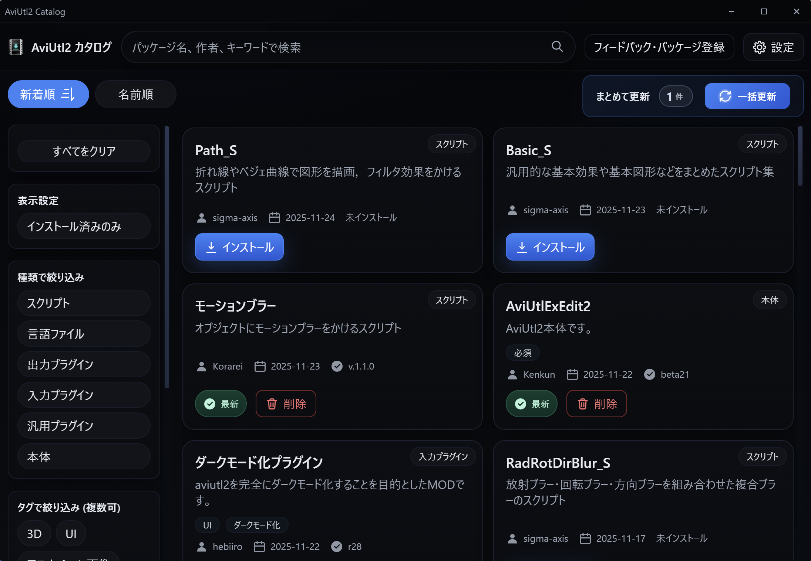
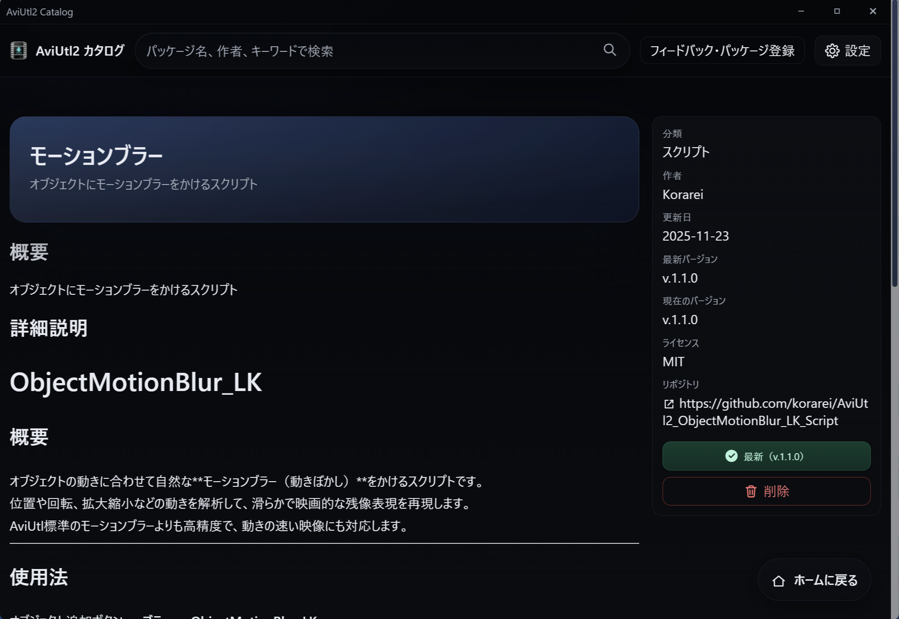
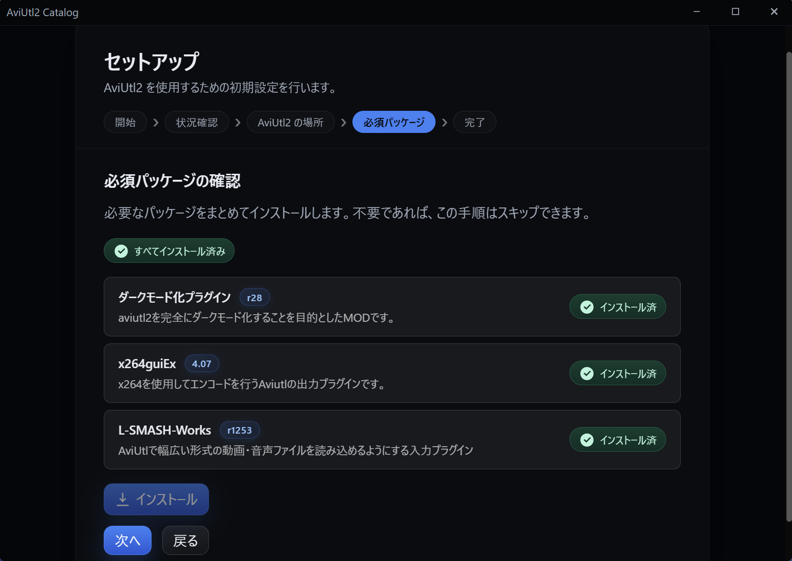
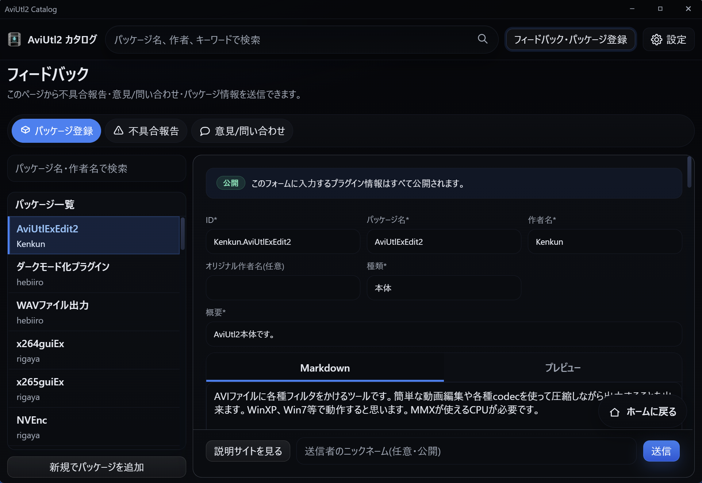
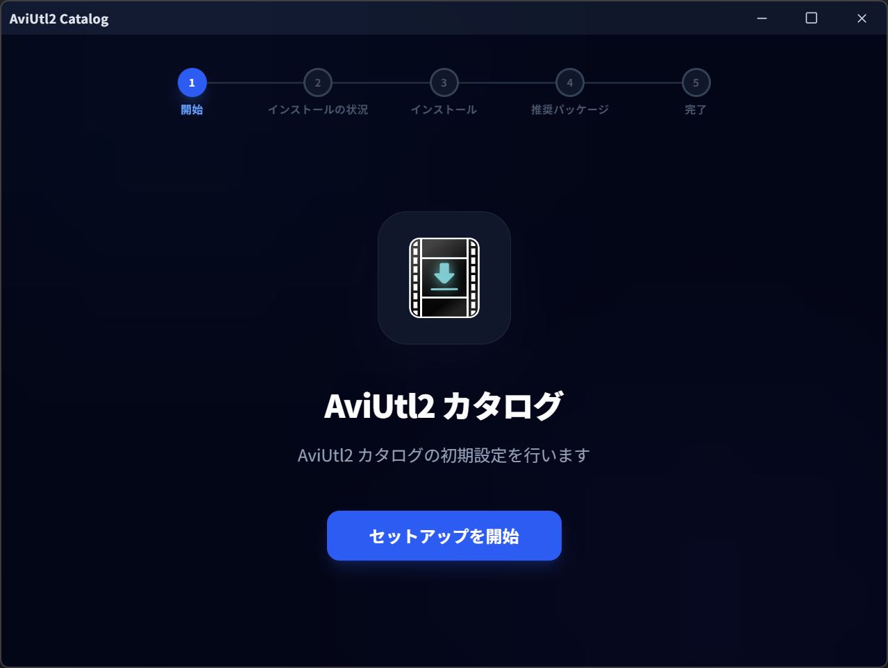
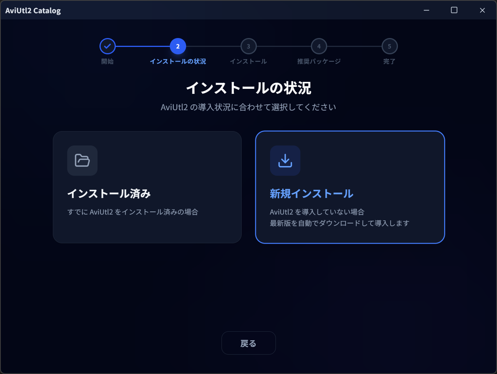
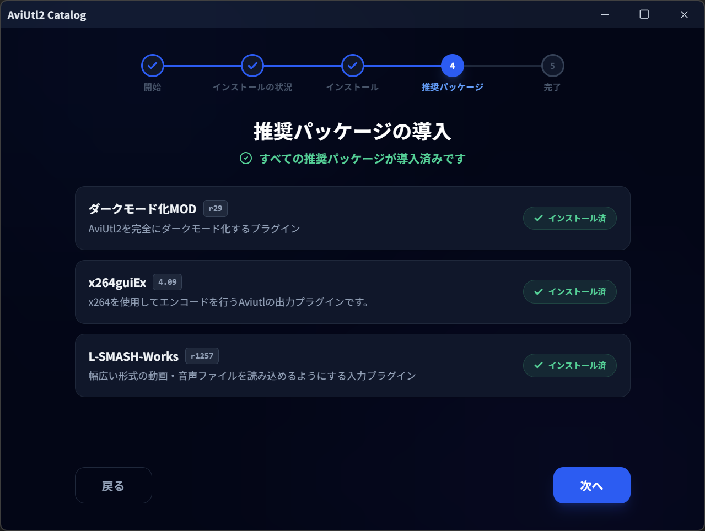

# AviUtl2 カタログ

AviUtl2のプラグインやスクリプトを、検索から導入・更新まで一括で管理できるデスクトップアプリです。
現在ベータ版です。

---

## 主な機能
- 🚀 AviUtl2本体および推奨プラグインを簡単に導入
* 📦 インストール・更新・削除をワンボタンでかんたん操作（一括更新にも対応）
* 🔔 AviUtl2本体やプラグイン／スクリプトに更新があると、AviUtl2のメニューバーでお知らせ
* 🔍 パッケージを検索・絞り込み
* 📋 ニコニ・コモンズIDをまとめてコピー
* 🧩 インストール済みパッケージを自動で検出（XXH3-128 ハッシュ使用）
* 📨 パッケージの登録（審査後、カタログに掲載）

---

## ダウンロード元の対応
現在以下のダウンロード元に対応しています
- 直接ダウンロードURL
- GitHub Releases
- Google Drive
- BOOTH

---

## 本ソフトのイメージ

<table>
  <tr>
    <td> メイン画面</td>
    <td> パッケージ詳細</td>
  </tr>
  <tr>
    <td> アップデートセンター</td>
    <td> パッケージ登録</td>
  </tr>
</table>

---

## セットアップのイメージ
本ソフトでは、AviUtl2本体および推奨プラグインのセットアップをワンボタンで行えます。

<table>
  <tr>
    <td> メイン画面</td>
    <td> パッケージ詳細</td>
  </tr>
  <tr>
    <td> アップデートセンター</td>
    <td> パッケージ登録</td>
  </tr>
</table>

---

## 画面構成
- **パッケージ一覧**: パッケージの一覧表示、検索、フィルタ/ソート
- **パッケージ詳細**: パッケージについての詳細説明
- **アップデートセンター**： インストール済みパッケージの更新を一括管理
- **パッケージ登録**： 新規パッケージの登録フォーム
- **フィードバック**: 不具合報告 / 意見・問い合わせ  
    

## カタログデータ

* パッケージ登録は、アプリ内の **パッケージ登録** からお願いします。（作者以外の方も大歓迎です）
* カタログデータは `aviutl2-catalog-data` の `index.json` に記録しています。30 分ごとに更新を自動確認します（Githubのリリース機能を用いてリリースしているパッケージのおみ）。
（[パッケージ一覧](https://github.com/Neosku/aviutl2-catalog-data/blob/main/パッケージ.md)）

---

## Deep Link（アプリ起動リンク）
カスタムスキーム `aviutl2-catalog://` でアプリを起動し、指定ページを直接開けます。  
リンクを開くとアプリが前面化し、対応ページへ遷移します。

対応パス:
- `aviutl2-catalog://`（ホーム）
- `aviutl2-catalog://updates`（アップデートセンター）
- `aviutl2-catalog://register`（パッケージ登録）
- `aviutl2-catalog://package/<package-id>`（パッケージ詳細）

オプション:
- `aviutl2-catalog://package/<package-id>?install=true`  
  パッケージ詳細を開いた上で、未インストールの場合は自動でインストールを開始します。

※ 上記以外のパスは無視されます。

---

## ライセンス

本ソフトウェアは **MIT ライセンス** です
