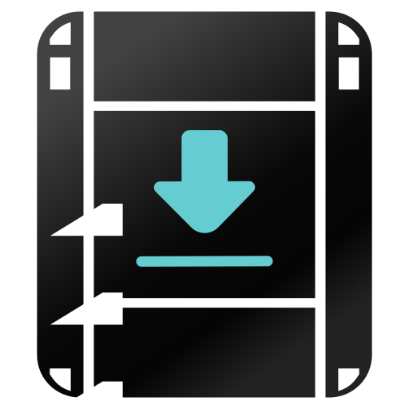
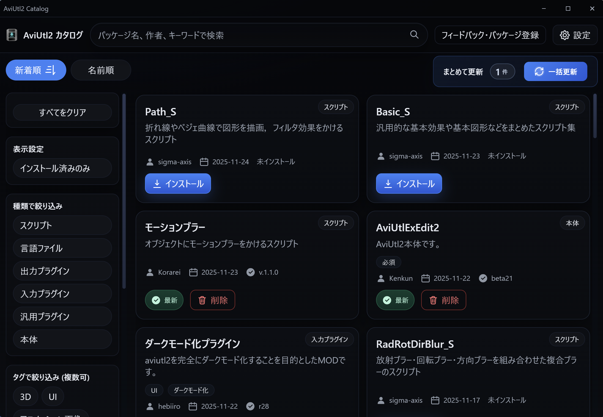
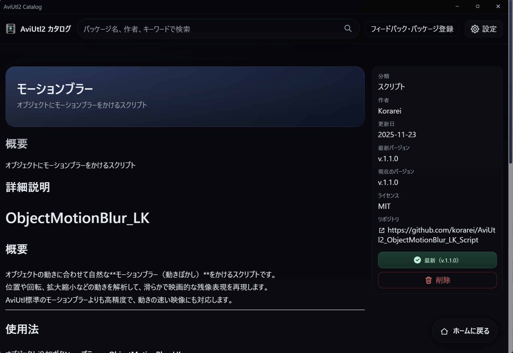
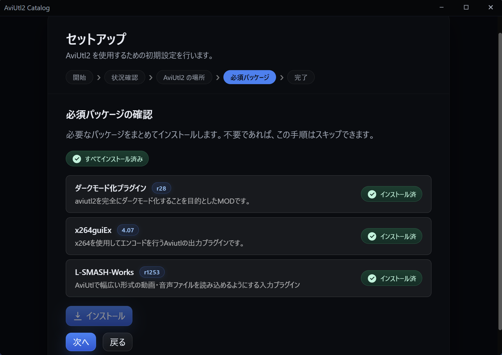
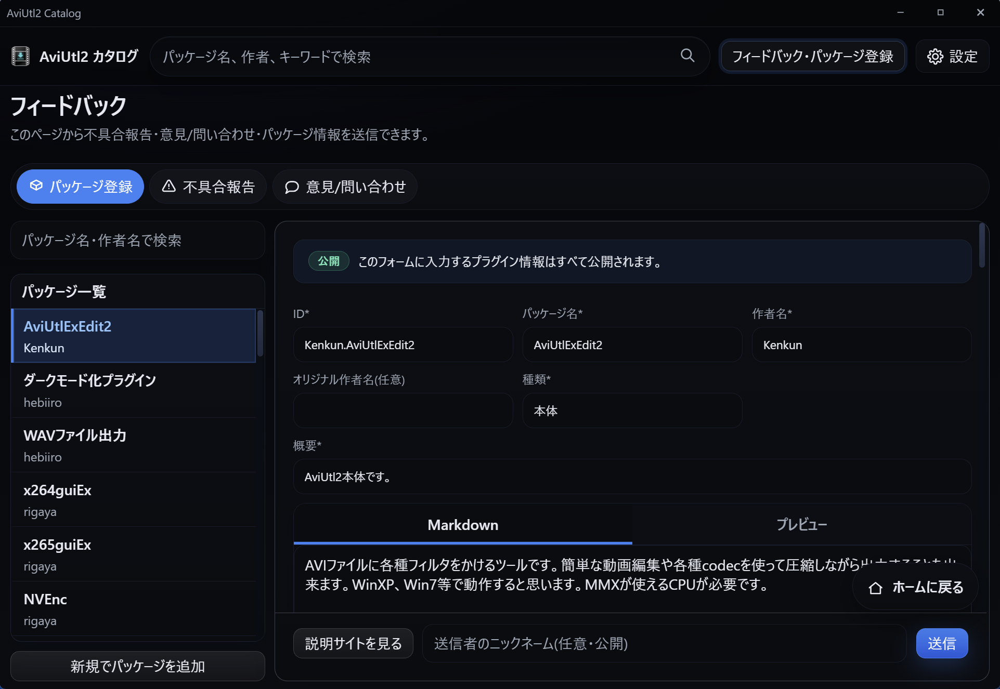
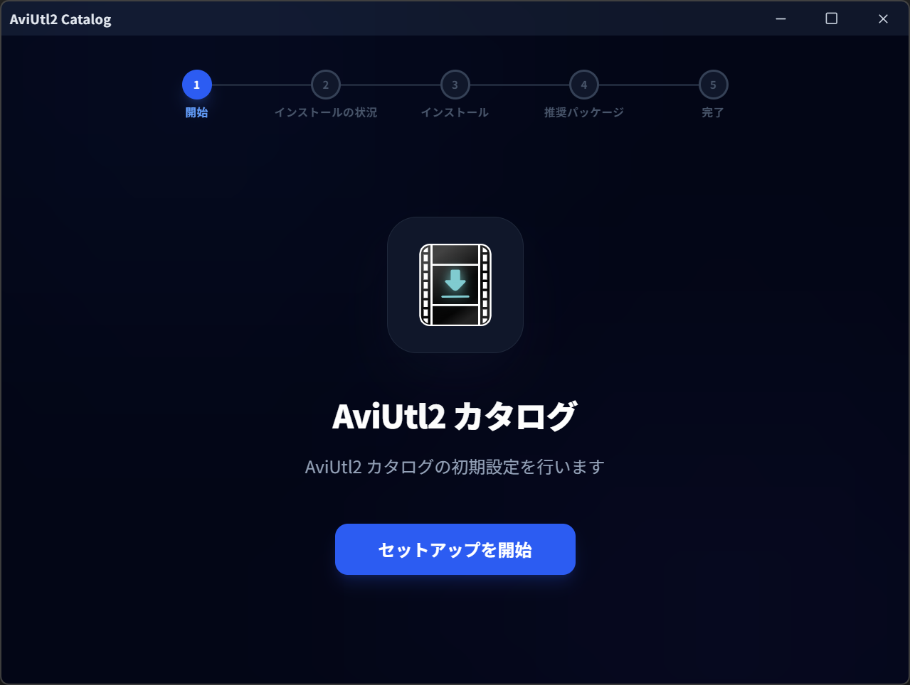
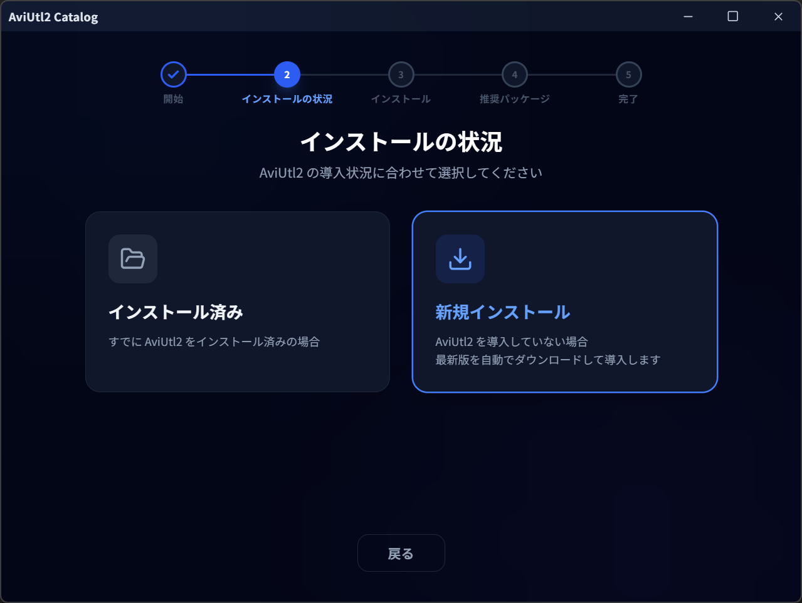
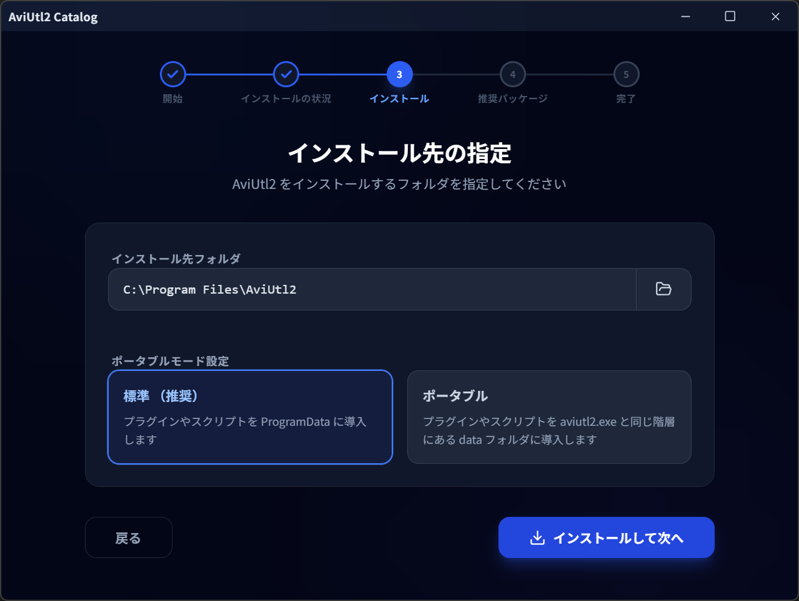
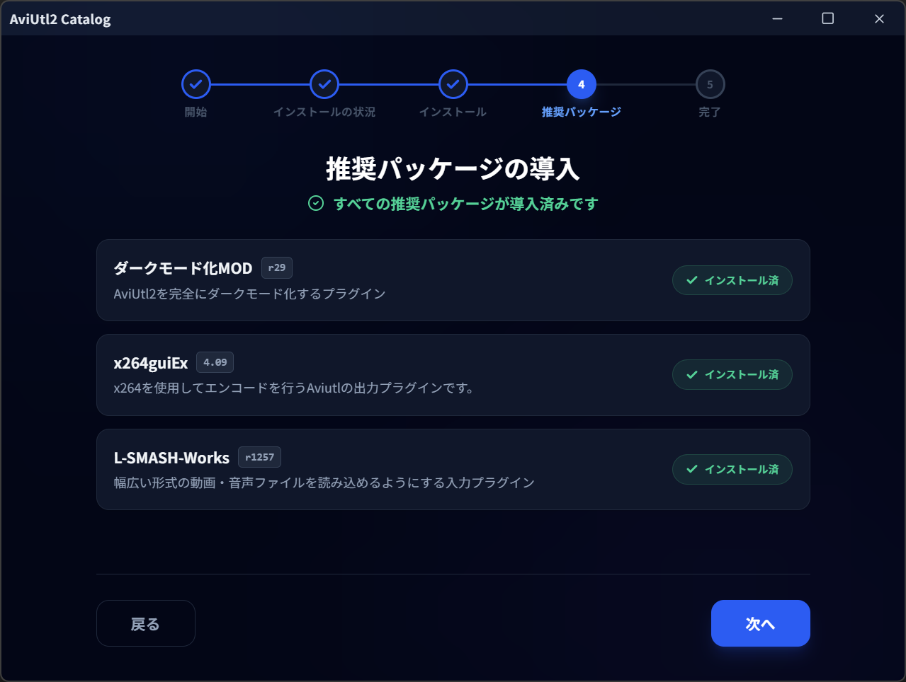

<h1 align="center">
  <br>
  AviUtl2 目录
</h1>

<p align="center">
  一款可集中管理 AviUtl2 插件和脚本的桌面应用<br>
  支持搜索、安装与更新
</p>

<p align="center">
  
  <a href="https://github.com/Neosku/aviutl2-catalog/releases/latest">
    
  </a>
  
  <a href="https://github.com/Neosku/aviutl2-catalog/releases/latest">
    
  </a>
  
  
</p>

<p align="center">
  <a href="../README.md">日本語</a> |
  <a href="./README.en.md">English</a> |
  <a href="./README.ko.md">한국어</a> |
  简体中文 |
  <a href="./README.zh-TW.md">繁體中文</a>
</p>

## 主要功能

- 🚀 轻松安装 AviUtl2 主程序及推荐插件
- 📦 一键完成安装、更新、删除，并支持批量更新
- 🔔 当 AviUtl2 主程序、插件或脚本有更新时，会在 AviUtl2 菜单栏中显示通知
- 🔍 搜索并筛选软件包
- 📋 批量复制 Nico Nico Commons ID
- 🧩 使用 XXH3-128 哈希自动检测已安装软件包
- 📨 支持提交软件包，审核后收录到目录中

---

## 支持的下载来源

当前支持以下下载来源：

- 直接下载 URL
- GitHub Releases
- Google Drive
- BOOTH

---

## 应用预览

<table>
  <tr>
    <td><br>主界面</td>
    <td><br>软件包详情</td>
  </tr>
  <tr>
    <td><br>更新中心</td>
    <td><br>软件包提交</td>
  </tr>
</table>

---

## 安装示意

本应用支持一键完成 AviUtl2 主程序及推荐插件的安装与设置。

<table>
  <tr>
    <td><br>主界面</td>
    <td><br>软件包详情</td>
  </tr>
  <tr>
    <td><br>更新中心</td>
    <td><br>软件包提交</td>
  </tr>
</table>

---

## 界面组成

- **软件包列表**：显示软件包列表，支持搜索、筛选和排序
- **软件包详情**：查看软件包的详细说明
- **更新中心**：集中管理已安装软件包的更新
- **软件包提交**：提交新软件包的表单
- **反馈**：提交问题、反馈或咨询

## 目录数据

- 请通过应用内的 **软件包提交** 功能提交软件包。非常欢迎作者以外的用户参与。
- 目录数据记录在 `aviutl2-catalog-data` 的 `index.json` 中。对于通过 GitHub Releases 发布的包，应用会每 30 分钟自动检查一次更新。
  ([软件包列表](https://github.com/Neosku/aviutl2-catalog-data/blob/main/%E3%83%91%E3%83%83%E3%82%B1%E3%83%BC%E3%82%B8.md))

---

## Deep Link（应用启动链接）

可以使用自定义协议 `aviutl2-catalog://` 启动应用并直接打开指定页面。  
打开链接后，应用会切换到前台并跳转到对应页面。

支持的路径：

- `aviutl2-catalog://`（首页）
- `aviutl2-catalog://updates`（更新中心）
- `aviutl2-catalog://register`（软件包提交）
- `aviutl2-catalog://package/<package-id>`（软件包详情）

选项：

- `aviutl2-catalog://package/<package-id>?install=true`  
  打开软件包详情页面后，如果该软件包尚未安装，则自动开始安装。

上述之外的路径会被忽略。

---

## 安装

### 手动安装（推荐）

1. 从 https://github.com/Neosku/aviutl2-catalog/releases/latest 下载最新版本
2. 运行下载好的安装程序（`.exe`）

### Winget

Winget 的收录或同步可能会有延迟。如果没有显示最新版本，请使用手动安装。

```powershell
winget install --id Neosku.AviUtl2-Catalog -e
```

## 更新

启动应用时，如果有可用更新会显示提示消息。按照界面指引即可直接更新。

---

## 翻译协力

- 中文翻译：@nsYW

---

## 许可证

本软件基于 **MIT 许可证** 发布。
